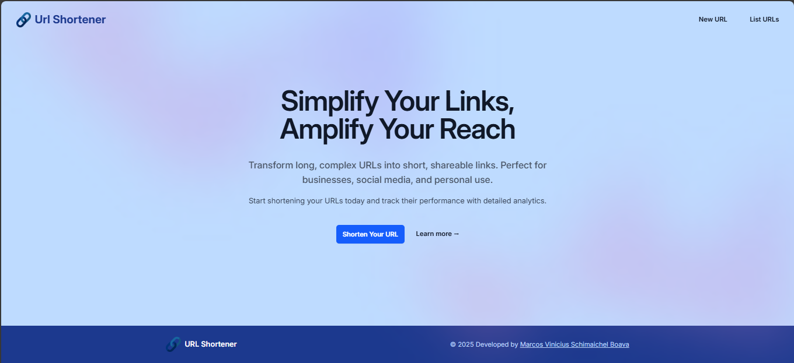
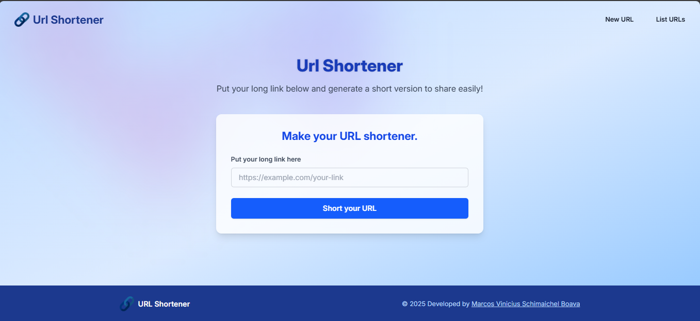
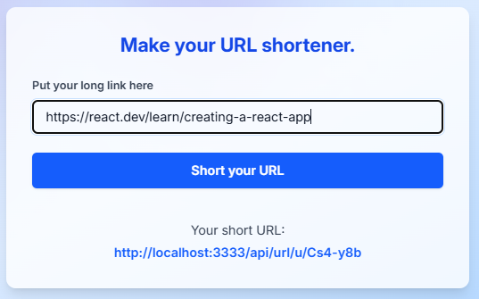
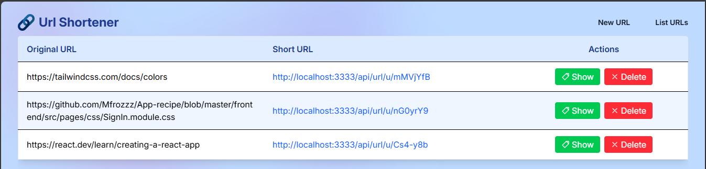

# URL Shortener

Um sistema completo de encurtamento de URLs, com backend em Node.js/Express/MongoDB e frontend em React + Tailwind. Permite criar, listar, deletar e redirecionar URLs curtas de forma simples e moderna.

- [EN-US Version (README)](README.md)

---

## Principais Funcionalidades

- Encurtamento de URLs longas para links curtos e fáceis de compartilhar
- Listagem e gerenciamento de URLs criadas
- Redirecionamento automático ao acessar a URL curta
- Exclusão de URLs
- Interface web responsiva e amigável
- Backend robusto com validação, rate limit e integração com MongoDB

---

## Como rodar o projeto

1. **Clone o repositório**
2. Siga as instruções específicas de cada parte do sistema:
   - [Documentação do Backend (README)](./backend/README-ptbr.md)
   - [Documentação do Frontend (README)](./frontend/README-ptbr.md)

---

## Estrutura do Projeto

```
Url-shortener/
├── backend/
|    └── Estrutura de Pastas do Back-end
├── frontend/
|    └── Estrutura de Pastas do Front-end
├── screenshots/
|    └── Pasta de capturas de tela
├── .gitignore
├── README-ptbr.md
└── README.md
```

---

## Screenshots

Abaixo algumas capturas de tela da aplicação em uso:

### Página Inicial


### Criar nova URL curta
- 
- 

### Lista das URLs criadas


Desenvolvido por [Marcos Vinicius Boava](https://github.com/Mfrozzz)