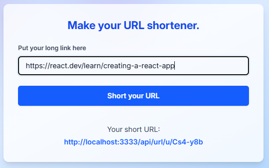

# URL Shortener

A complete URL shortening system, with a backend in Node.js/Express/MongoDB and a frontend in React + Tailwind. It allows you to create, list, delete, and redirect short URLs in a simple and modern way.

- [Versão em Português (README)](README-ptbr.md)

---

## Main Features

- Shortening long URLs into short, easy-to-share links
- Listing and managing created URLs
- Automatic redirection when accessing the short URL
- URL deletion
- Responsive and user-friendly web interface
- Robust backend with validation, rate limiting, and MongoDB integration

---

## How to run the project

1. **Clone the repository**
2. Follow the specific instructions for each part of the system:
   - [Backend Documentation (README)](./backend/README.md)
   - [Frontend Documentation (README)](./frontend/README.md)

---

## Project Structure

```
Url-shortener/
├── backend/
|    └── Backend Folder Structure
├── frontend/
|    └── Frontend Folder Structure
├── screenshots/
|    └── Screenshots Folder
├── .gitignore
├── README-ptbr.md
└── README.md
```

---

## Screenshots

Below are some screenshots of the application in action:

### Home Page


### Create Short URL
- 
- 

### List of URLs


Developed by [Marcos Vinicius Boava](https://github.com/Mfrozzz)